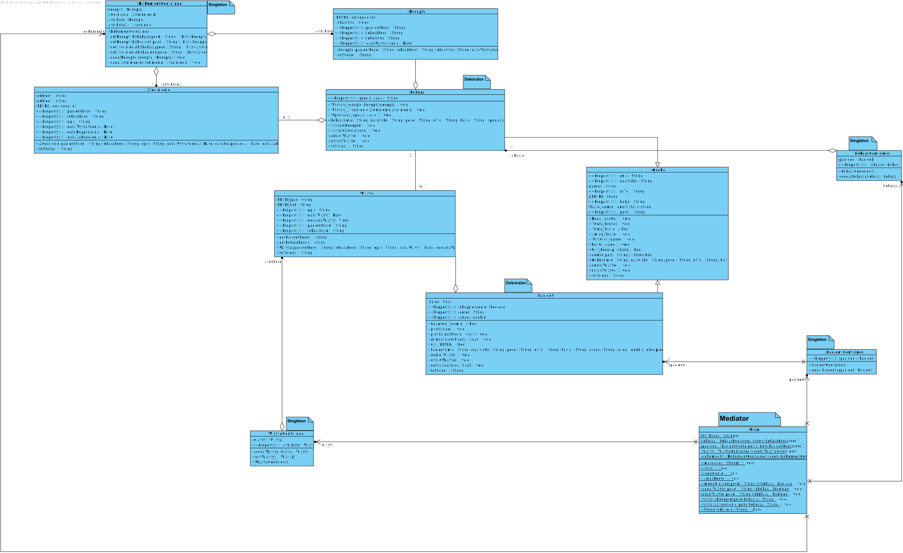

# Wzorce projektowe
Projekt przedstawiający elektroniczny system obsługi przychodni lekarskiej na przedmiot wzorce projektowe w roku akademickim 2020/2021.

## Diagram klas

## Wykorzystane wzorce
* Singleton
* Dekorator
* Mediator

Wzorzec kreacyjny `Singleton` zapewnia, że dla całego programu występuje tylko jedna instancja klas przechowujących dane pacjentów, lekarzy, dokumentów oraz wizyt. Udostępnia też globalny punkt dostepowy do tej instancji.

Wzorzec strukturalny `Dekorator` pozwala dodawać nowe obowiązki obiektom, sprawia że klasy Lekarz oraz Pacjent rozszerzają mozliwosci klasy Osoba.

Wzorzec behawioralny `Mediator` to wzorzec projektowy pozwalający ograniczyć bezpośrednią komunikację pomiędzy obiektami i zmusza je do współpracy wyłącznie za pośrednictwem obiektu mediatora (klasy Main). Pozwala na uporządkowanie zależności i zapewnia większą przejrzystość działania programu.
